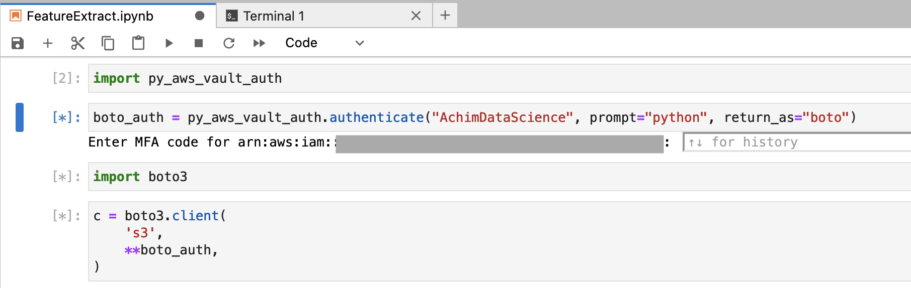
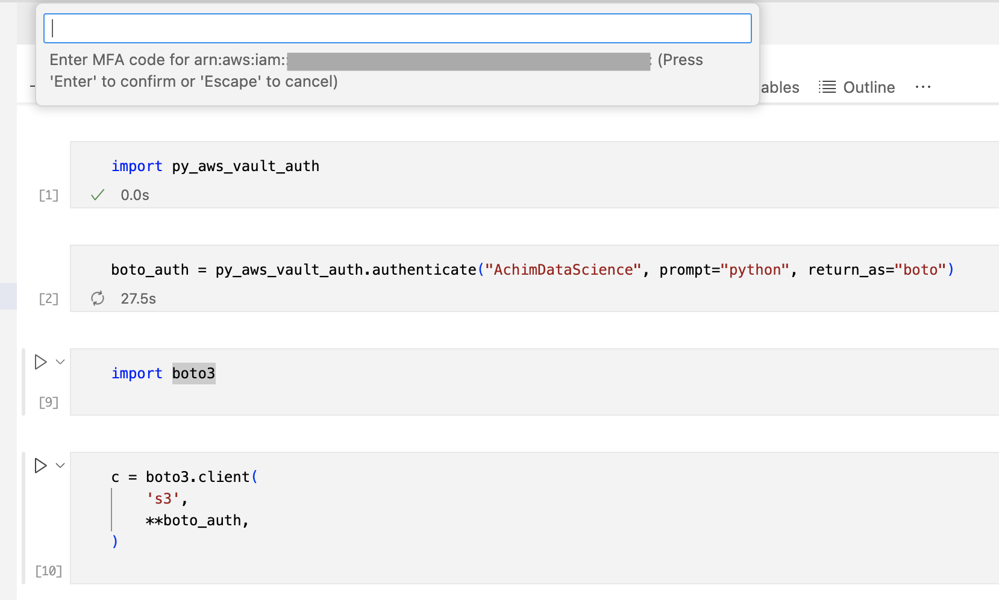

# py-aws-vault-auth

This is a wrapper for the [`aws-vault` command](https://github.com/99designs/aws-vault).<br/>
This is **not** an interface to the AWS (glacier) vault.

## Introduction

(Re)-Authenticate for AWS services using `aws-vault` within a python session
(e.g jupyter notebooks):

```python3
import py_aws_vault_auth
import boto3

boto_auth = py_aws_vault_auth.authenticate("DataScience", return_as="boto")
c = boto3.client("s3", **boto_auth)
c.list_objects_v2(Bucket="your-bucket")
```

In a Jupyterlab notebook this looks like this



or in a VSCode notebook



by virtue of a context-adjusted version of the builtin [`input` function](
https://docs.python.org/3/library/functions.html#input) - these are
auto-magically provided by Jupyterlab and VSCode.

## S3 access

That's probably the most prominent data-science usecase...

With `boto3` (that works of course for all other services):

```python3
boto_auth = py_aws_vault_auth.authenticate("DataScience", return_as="boto")
import boto3
c = boto3.client("s3", **boto_auth)
c.list_objects_v2(Bucket="your-bucket")
```

With `s3fs`

```python3
s3fs_auth = py_aws_vault_auth.authenticate("DataScience", return_as="s3fs")
import s3fs
fs = s3fs.S3FileSystem(**s3fs_auth)
fs.ls("s3://my-bucket/")
```

With `pandas` (implicitly via `fsspec` and `s3fs`)

```python3
s3fs_auth = py_aws_vault_auth.authenticate("DataScience", return_as="s3fs")
import pandas
pandas.read_csv("s3://my-bucket/my_file",
                storage_options=s3fs_auth
)
```

Just add the credentials to the environment:

```python3
environ_auth = py_aws_vault_auth.authenticate("DataScience", return_as="environ")
import os, subprocess
subprocess.call(
    ["aws", "s3", "ls", "my-bucket"],
    env=os.environ | environ_auth  # for python >= 3.9
    # env={**os.environ, **environ_auth}  # for python<3.9
)
```

## Credentials Handling

Without specifying `return_as` the function `authenticate` returns all
environment variables starting with `AWS_` as seen by the subprocess
started by aws-vault - that includes credentials, their expiration time
and the region for the profile.

The expiration time can be parsed with `datetime.datetime.fromisoformat`
when using `python>=3.11`, otherwise use `dateutil.parser.isoparse`.

The functions `to_boto_auth`, `to_environ_auth` and `to_s3fs_auth` create the
relevant authentication parameters. These can be imported from `py_aws_vault_auth`
in order to use the same credentials for `boto` and `s3fs`, e.g.

```python3
ds_credentials = py_aws_vault_auth.authenticate("DataScience")
athena_client = boto3.client("athena", **to_boto_auth(ds_credentials))
```

## Installation

No dependencies, just `python3`... and of course [`aws-vault`](https://github.com/99designs/aws-vault)

```sh
pip install -U git+https://github.com/achimgaedke/py-aws-vault-auth.git
```

## Project Scope

Make the AWS authentication with the command line tool `aws-vault` easy in an
interactive context different from a terminal, e.g. jupyter notebook.

This project does:

* help with AWS authentication with `aws-vault` mid-session, i.e.
* make it easy for data-scientists to avoid copying credentials into a notebook
* avoid starting jupyter with `aws-vault exec XXX -- jupyter lab` (or VSCode...)
* return the AWS credentials directly usable with popular data-science tools
* request the MFA token via python's input context, i.e. the `input` built-in function
* aims to work in Linux/MacOS (and hopefully MS Windows) wo extra dependencies and
  supportin a variety of python3 versions

If you prefer another window poping up somewhere, you can use `prompt="osascript"`
(with MacOS) or similar. This won't use python's `input` function.

This project does **not**:

* use all features of `aws-vault`
* capture the input dialogues for various key-chain/password managers

To avoid too many password manager input dialogues, have a look at [the
`aws-vault` documentation](https://github.com/99designs/aws-vault/blob/master/USAGE.md#backends).

## Project Maturity

**Please** star this [repository](https://github.com/achimgaedke/py-aws-vault-auth)
if you like it or use the [issue-tracker](https://github.com/achimgaedke/py-aws-vault-auth/issues)
to share some feedback.

This project is born out of need for a smoother integration of devops tools/requirements
with data-science tools. At the moment, it is simply factoring out some code I use
privately.

The project is developed on MacOS, python-3.11 - I will test it with other versions later.

Yes, the thread-based polling of `stderr` is kind of awkward. Once upon a time
this was the most portable way of waiting on output - or it was 6 years ago.
I might revisit this part another time, as OS and backwards-compatibility got
better. (I'm aware of `select`, `async`, or setting streams to non-blocking mode)

Ah, and tests are missing...
